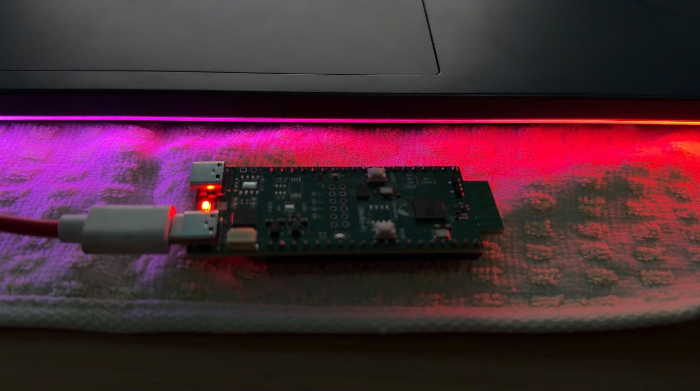
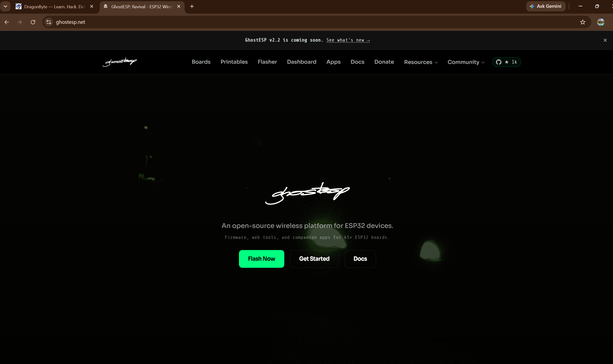
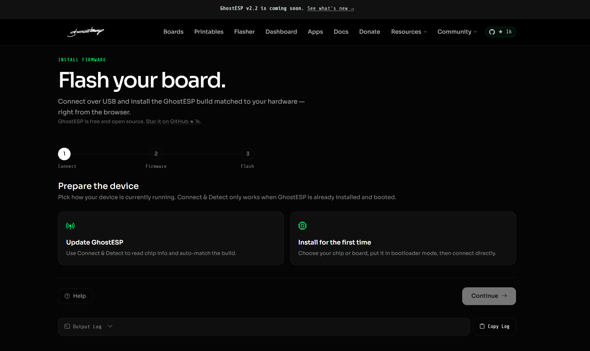
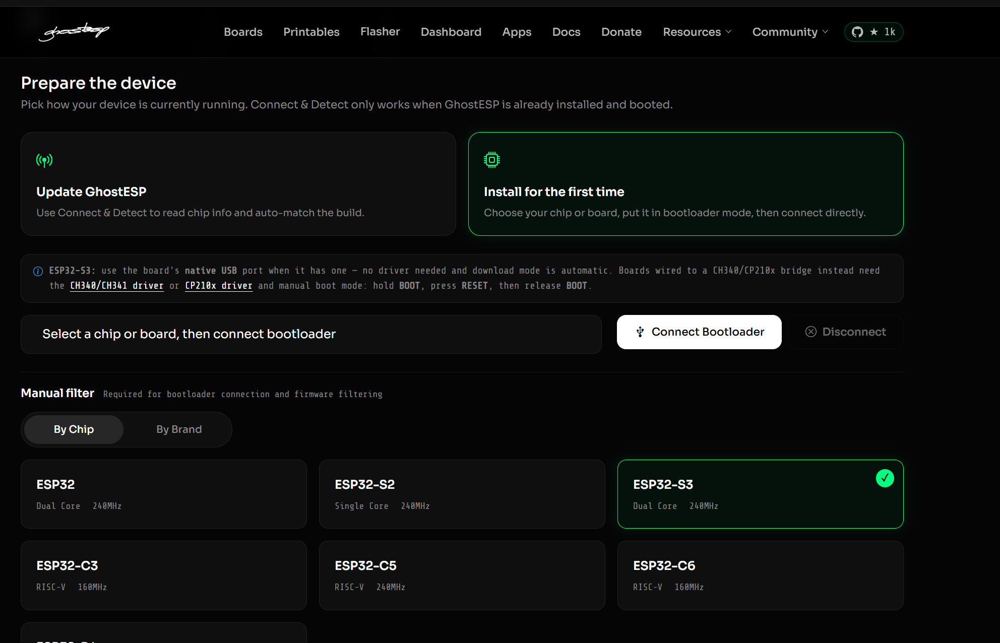
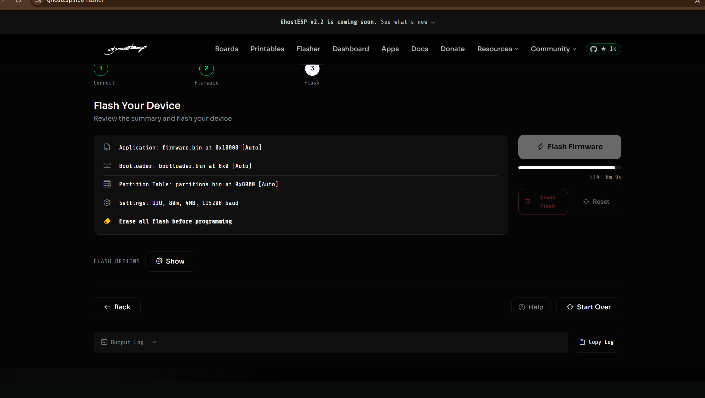
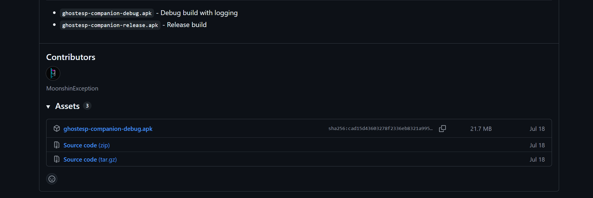

# Exploring IoT Wireless Security with ESP32-S3 and GhostESP

*A DragonByte field report — Learn. Hack. Defend. Grow.*

## Why we built this

Most people's idea of "Wi-Fi hacking" comes from TV, not from actually watching a packet capture. We wanted a project small enough to finish in a weekend but real enough to teach something that sticks — so we picked up an ESP32-S3, flashed it with the open-source [GhostESP](https://ghostesp.net) firmware, and used it to explore exactly what our own devices broadcast into the air around them, all the time, whether we're paying attention or not.

This article covers the whole process — hardware, firmware, Wi-Fi and BLE exploration, the captive-portal concept, mobile testing, what broke along the way, and the ethical line we were careful not to cross.

## The hardware

The ESP32-S3 is a dual-core 240MHz chip with native 2.4GHz Wi-Fi and Bluetooth LE — small enough to sit in the palm of your hand, capable enough to run a full scanning and advertising firmware stack. Our board uses a native USB interface, which turned out to matter a lot during setup: no driver to install, and the flasher put it into bootloader mode automatically.

For the full rundown of identifying your own board's USB interface before you start, see [02 · Hardware](../docs/02-hardware.md).

## Installing GhostESP

GhostESP ships an official browser-based flasher, so there's no local toolchain to install for a standard flash — just a Chromium-based browser and a USB cable.

The flasher walks through three steps: connect, select your chip, and flash.

We selected ESP32-S3 directly from the chip list rather than hunting for our exact board brand:

And then let the flasher do its thing — bootloader, partition table, and application image, all written in one pass:

The whole process took under a minute end to end, and the board rebooted straight into GhostESP without any extra steps. Full walkthrough, including the manual bootloader sequence needed on bridge-chip boards, is in [03 · Firmware setup](../docs/03-firmware-setup.md).

## What Wi-Fi scanning actually shows you

Once GhostESP was running, the first thing we did was point it at our own home network. The result is almost anticlimactic: SSID, channel, signal strength, and security type, all pulled from beacon frames every access point sends out constantly, with no authentication involved at any point. It's the same information your phone already reads every time it shows you a list of nearby networks — GhostESP just lets you see it directly instead of through a polished UI that hides the details.

The genuinely useful part wasn't "look what I can see" — it was walking the board around the house and watching signal strength degrade near certain walls, which gave us a better case for where to put a Wi-Fi extender than guessing ever did. Full details in [04 · Wi-Fi testing](../docs/04-wifi-testing.md).

## BLE: the quieter, more revealing protocol

Bluetooth Low Energy turned out to be the more interesting half of this project. Most of our BLE-capable devices — a pair of headphones, a fitness band, a couple of smart-home sensors — advertise constantly when discoverable, and some advertise more than they probably should. A device with a human-readable name and a static MAC address is trivially identifiable to anything listening nearby; one with a rotating MAC address and no name is much harder to track.

Scanning our own devices was a good reminder that "BLE privacy" is a spectrum different manufacturers land on very differently. Details and a hands-on exercise are in [05 · Bluetooth testing](../docs/05-bluetooth-testing.md).

## Captive portals: the concept, not the trap

We almost skipped this section. A captive portal — the "accept terms to continue" page you see on hotel or airport Wi-Fi — is also the exact mechanism behind "evil twin" phishing attacks, where a fake open network captures credentials from anyone who tries to join it. We didn't want to ship anything resembling that, even as a demo.

What we built instead is a static, clearly-labeled layout preview with no password field and no data collection of any kind — enough to show the *structure* of a captive portal without the part that makes it dangerous. If you want to go further on your own hardware, [06 · Captive portal lab](../docs/06-captive-portal-lab.md) spells out exactly where we think the ethical line sits and why.

## Mobile testing

We used our own Android phone with the GhostESP companion app (downloaded from the [official GitHub releases page](https://github.com/)) to control the board directly instead of going through a serial console:

iOS doesn't support sideloading the companion app, so for Apple devices we relied on the on-device web dashboard and used the phone mainly as a *target* — toggling Bluetooth visibility on and off and confirming it appeared and disappeared from scans as expected. Both approaches are documented in [07 · Mobile testing](../docs/07-mobile-testing.md).

## What actually went wrong

In the interest of not pretending everything was seamless: our first flash attempt stalled partway through at the default baud rate over a long, cheap USB cable. Swapping to a shorter cable and re-flashing with "erase all flash before programming" enabled fixed it on the second attempt. If you hit something similar, [03 · Firmware setup](../docs/03-firmware-setup.md#troubleshooting) has the full troubleshooting list we built from that and a few other snags.

## Lessons learned

- **Open protocols are more exposed than most people assume**, and that's by design — beacon frames and BLE advertisements exist specifically to be discoverable. The lesson isn't that this is a flaw to exploit; it's a reason to care about what your own devices are broadcasting.
- **Hardware details matter more than firmware features.** Nearly every setup issue we hit traced back to the USB cable or the native-vs-bridge USB distinction, not to GhostESP itself.
- **The line between "security education" and "attack tooling" is a design choice, not an accident.** A captive portal demo without a working credential form is a deliberate decision, not a missing feature.

## What's next for this project

We'd like to extend [08 · Results](../docs/08-results.md) with longer-running scan logs across more device types, and look at how BLE MAC randomization behaves differently across the specific devices we own. If you build on this project yourself, we'd genuinely like to hear what you found — see [CONTRIBUTING.md](../CONTRIBUTING.md).

## Ethical considerations, restated

Everything above was run against hardware and networks we own. If you're reproducing any part of this, the same rule applies to you: your own devices, your own network, or explicit written authorization — nothing else. Full policy in [09 · Ethical use](../docs/09-ethical-use.md).

---

*DragonByte — Learn. Hack. Defend. Grow.*
